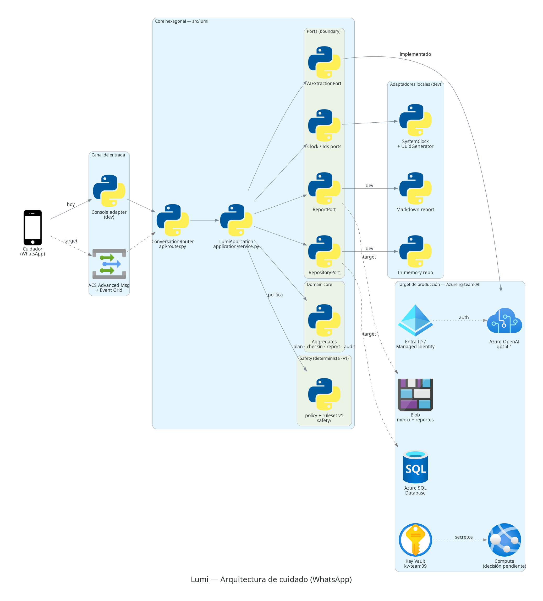

# Lumi

Lumi is a WhatsApp-oriented care copilot for caregivers of babies (6–24 months)
with atopic dermatitis. It helps the caregiver keep an accurate record, follow
the doctor-authored medical plan, observe changes over time, and prepare useful
information for the next consultation.

> The caregiver observes, Lumi understands, the doctor decides.

## Architecture



Lumi is a hexagonal (ports & adapters) application. The domain core and safety
policy hold the invariants; the language model only produces structured
*proposals* that deterministic code validates before persisting. Every external
concern — channel, AI, persistence, media, reports — sits behind a port so the
local development adapters (console, in-memory, markdown) can be swapped for the
production Azure target (ACS + Event Grid, Azure SQL, Blob, Azure OpenAI) without
touching the core.

Edge legend in the diagram: **solid** = implemented today · **dashed** = accepted
production target, not yet wired · **dotted grey** = cross-cutting identity/secrets.

The diagram is generated, not hand-drawn — regenerate it after architecture
changes with:

```bash
uv run python scripts/render_architecture.py   # → docs/diagrams/lumi_architecture.png
```

See [`docs/ARCHITECTURE.md`](docs/ARCHITECTURE.md) for the full component
breakdown, request flow, and Azure mapping.

## Product boundary

The main product is the longitudinal care workflow described in
[`docs/PRODUCT.md`](docs/PRODUCT.md):

1. Capture and version the doctor-authored medical plan.
2. Record short daily check-ins and label every treatment by source
   (`prescribed` vs `non_prescribed`).
3. Surface descriptive patterns without diagnosing or assigning causality.
4. Generate a concise report for the treating clinician.

Hard rules (enforced in code, not prompts): never diagnose or assign clinical
severity, never add/remove/alter a prescribed treatment, a prescribed item enters
the active plan only after explicit caregiver confirmation (creating an immutable
plan version), and red-flag escalation is a deterministic, clinician-owned policy
the model cannot override.

## Repository map

```text
.
├── docs/
│   ├── PRODUCT.md            Product behavior, language, and non-goals
│   ├── ARCHITECTURE.md       Target boundaries, request flow, Azure mapping
│   ├── RISK_REGISTER.md      Clinical, privacy, AI, and operational risks
│   ├── IMPLEMENTATION_PLAN.md Delivery phases and exit criteria
│   └── diagrams/             Generated architecture PNG
├── src/
│   ├── lumi/                 Main product (must not import the acoustic package)
│   │   ├── domain/           Aggregates & value objects, enums, invariants
│   │   ├── application/      Use-case service, commands, results, AI mapping
│   │   ├── safety/           Deterministic versioned red-flag policy (ruleset v1)
│   │   ├── ports/            Abstract boundaries: ai, channel, repository, …
│   │   ├── adapters/         ai/ (Azure OpenAI), channel/, persistence/, reports/
│   │   └── api/              ConversationRouter + CLI entrypoint (`lumi`)
│   └── dermatomicos_bago/    Isolated acoustic research experiment (not in MVP)
├── scripts/
│   ├── check_azure_environment.py  Verifies Azure resource metadata
│   ├── render_architecture.py      Renders the architecture diagram
│   └── record_dataset.py           Records labeled scratch clips (acoustic)
├── evals/datasets/          Extraction eval data (es-PE)
├── tests/lumi/              Lumi unit tests (domain, application, router, ai)
└── tests/                   Acoustic pipeline tests
```

The `lumi` package must **not** import from `dermatomicos_bago`. TensorFlow,
YAMNet, the microphone, and scratch classification are experimental and are not
runtime dependencies of Lumi.

## Voice notes

A voice note is just another way to author a check-in: audio is transcribed **at
the edge** and the resulting text flows into the *same* untrusted extraction /
check-in path as a typed message — the conversation core never sees audio. Behind
the `Transcriber` port sit three swappable adapters: a deterministic canned one
(demo/tests), **Azure OpenAI Whisper** (the real engine), and a local
faster-whisper fallback (`[voice]` extra). The demo exposes `/api/voice` (scripted
samples) and `/api/voice/upload` (real recorded audio).

> ⚠️ Whisper on Azure is served on the **classic deployment-scoped path**
> (`/openai/deployments/{deployment}/audio/transcriptions?api-version=…`), **not**
> the `/openai/v1` surface the chat extractor uses — so its adapter drives the
> `AzureOpenAI` client. Full details, config and the deploy gotcha in
> [`docs/VOICE_NOTES.md`](docs/VOICE_NOTES.md).

Enable real transcription by creating a transcription deployment and pointing the
demo at it:

```bash
az cognitiveservices account deployment create \
  --name <resource> --resource-group rg-team-09 \
  --deployment-name whisper --model-name whisper --model-version 001 \
  --model-format OpenAI --sku-name Standard --sku-capacity 1
# then in .env:  AZURE_OPENAI_TRANSCRIBE_DEPLOYMENT=whisper
```

## Live demo (deploy)

The web demo is deployed to **Azure App Service** (Linux container) at
**https://lumi-demo-cg65uw.azurewebsites.net** — HTTPS (required for the in-browser
microphone), with Azure Whisper wired for real transcription. The image is
deliberately minimal: it installs only the Lumi runtime deps (`[web]` + `[azure]`)
and **not** the acoustic base dependencies (TensorFlow, sounddevice…), since the
`lumi` package is isolated from `dermatomicos_bago`.

Build / redeploy (image lives in ACR `lumiacrcg65uw`):

```bash
az acr login -n lumiacrcg65uw
docker build -t lumiacrcg65uw.azurecr.io/lumi-demo:v2 .
docker push lumiacrcg65uw.azurecr.io/lumi-demo:v2
az webapp config container set -n lumi-demo-cg65uw -g rg-team-09 \
  --container-image-name lumiacrcg65uw.azurecr.io/lumi-demo:v2 \
  --container-registry-url https://lumiacrcg65uw.azurecr.io
az webapp restart -n lumi-demo-cg65uw -g rg-team-09
```

Notes on the deploy decisions (constrained by **Contributor** RBAC on `rg-team-09`):

- It is **App Service**, not Azure Container Apps — the `Microsoft.App` provider is
  unregistered at the subscription and registering it needs subscription-level
  permission. App Service (`Microsoft.Web`) is the viable equivalent without admin.
- Auth uses the **API key as an encrypted app setting** (not in the repo), not
  managed identity, because granting the app's identity the `Cognitive Services
  OpenAI User` role needs role-assignment rights that Contributor lacks. The ACR
  pull uses registry admin credentials for the same reason. Migrating to managed
  identity + Container Apps is a follow-up once RBAC allows.

Tear down to stop the ~\$18/mo cost (App Service B1 + ACR Basic):

```bash
az webapp delete -n lumi-demo-cg65uw -g rg-team-09
az appservice plan delete -n lumi-plan -g rg-team-09 --yes
az acr delete -n lumiacrcg65uw -g rg-team-09 --yes
```

## Local setup

Prerequisites: Python 3.11, [`uv`](https://docs.astral.sh/uv/), Graphviz (only
for rendering the diagram), and Azure CLI authenticated to the hackathon
subscription.

```bash
cp config.example.json config.json
az account set --subscription b893ca12-45bd-47b3-a0ac-081a74a9d4f6
uv sync                                          # core + dev (incl. diagrams)
uv run python scripts/check_azure_environment.py
uv run ruff check .
uv run pytest -q                                 # add -m "not slow" to skip model/hardware tests
```

For a local Azure OpenAI demo, keep credentials only in the ignored `.env` file
and run:

```bash
uv run --extra azure --env-file .env lumi
```

`AZURE_OPENAI_API_KEY` is supported as a temporary local-demo fallback. Leave it
unset to use Microsoft Entra ID via `DefaultAzureCredential`, which remains the
production authentication target.

`config.json` and `.env` are local-only. Never commit credentials, access keys,
WhatsApp tokens, patient data, photos, audio, or generated clinical reports.

## Current Azure environment

The environment checker expects the existing AI Services account with a
`gpt-4.1` deployment, Foundry project, Storage account, and Key Vault in
`rg-team-09`. Compute, the production database (Azure SQL), the WhatsApp provider
(ACS), and application observability are not provisioned yet; those remain
explicit architecture decisions (see `docs/ARCHITECTURE.md`).

## Acoustic experiment

The acoustic scratch/crying detector under `src/dermatomicos_bago/` is retained
as an experimental module. It is **not** part of the Lumi MVP and must not drive
clinical language, severity decisions, or alerts until it passes a separate
dataset-provenance, consent, performance, privacy, failure-mode, and clinical
validation gate.

## Issue tracking

This project uses **beads** (`bd`) for issue tracking — run `bd ready` to see
available work and `bd prime` for the full workflow. `main` is protected: changes
land through a PR gated on green CI and resolved review conversations.
